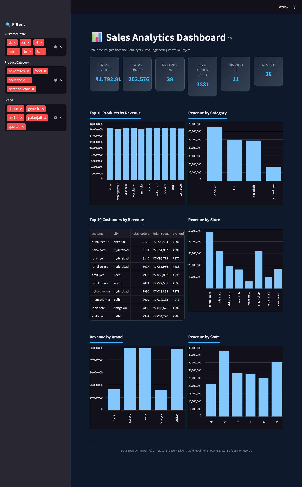

[](https://github.com/minnu-et/sales-data-pipeline/actions)

# Sales Data Engineering Pipeline

End-to-end data pipeline that ingests sales data from CSV files, processes it through Bronze → Silver → Gold layers on AWS S3, and serves analytics via a Streamlit dashboard. Built with PySpark, Airflow, Great Expectations, and SCD Type 2 change tracking.




## Architecture

```
CSV Files (Source: resources/data/)
  ├── customer.csv
  ├── product.csv
  ├── sales_data.csv
  └── store.csv
    │
    ▼
┌──────────────────────────────────────────────────┐
│  Bronze Layer (Raw Ingestion)                    │
│  S3: s3://bucket/bronze/{customers,products,...}  │
│  • Schema validation via Great Expectations       │
│  • Incremental loads via WatermarkManager         │
└──────────────┬───────────────────────────────────┘
               │
               ▼
┌──────────────────────────────────────────────────┐
│  Silver Layer (Cleaned & Transformed)            │
│  S3: s3://bucket/silver/{customers,products,...}  │
│  • Data type casting, null handling, dedup        │
│  • SCD Type 2 on customer dimension               │
│  • Quality checks via Great Expectations          │
└──────────────┬───────────────────────────────────┘
               │
               ▼
┌──────────────────────────────────────────────────┐
│  Gold Layer (Analytics-Ready)                    │
│  S3: s3://bucket/gold/sales_enriched             │
│  S3: s3://bucket/gold/customer_metrics           │
│  • Denormalized fact table (sales + dims)         │
│  • Customer aggregated metrics                    │
└──────────────┬───────────────────────────────────┘
               │
               ▼
┌──────────────────────────────────────────────────┐
│  Streamlit Dashboard                             │
│  • KPIs, filters, charts                          │
│  • Reads directly from S3 Gold layer              │
└──────────────────────────────────────────────────┘
```

## Tech Stack

| Component | Technology |
|---|---|
| Processing | PySpark 3.4.1 |
| Storage | AWS S3 (ap-south-1) |
| Source Data | CSV files (customer, product, sales, store) |
| Orchestration | Apache Airflow |
| Data Quality | Great Expectations (4 validation suites) |
| Change Tracking | SCD Type 2 (customer dimension) |
| Incremental Loading | Custom WatermarkManager |
| Dashboard | Streamlit |
| Config | YAML-based with environment overrides |
| Testing | pytest (28 unit/integration tests) |
| Language | Python 3.12 |

## Project Structure

```
sales-data-pipeline/
├── resources/
│   └── data/                        # Source CSV files
│       ├── customer.csv
│       ├── product.csv
│       ├── sales_data.csv
│       └── store.csv
├── config/
│   ├── config.yaml                  # Main pipeline configuration
│   ├── schemas/                     # Schema definitions
│   └── environments/
│       ├── dev.yaml                 # Dev environment overrides
│       └── prod.yaml               # Prod environment overrides
├── src/
│   ├── main/
│   │   ├── main.py                  # Pipeline entry point
│   │   ├── read/
│   │   │   ├── database_read.py     # Database reader
│   │   │   ├── aws_read.py          # S3 reader
│   │   │   └── read_csv.py          # CSV source reader
│   │   ├── transformations/
│   │   │   ├── customer_transform.py
│   │   │   ├── product_transform.py
│   │   │   ├── sales_transform.py
│   │   │   ├── store_transform.py
│   │   │   └── scd_customer_transform.py   # SCD Type 2
│   │   ├── gold/
│   │   │   ├── sales_gold.py               # Enriched sales fact
│   │   │   └── customer_metrics_gold.py    # Customer aggregations
│   │   ├── write/
│   │   │   ├── parquet_writer.py
│   │   │   ├── write_parquet.py
│   │   │   └── database_write.py
│   │   └── utility/
│   │       ├── config_loader.py     # YAML config management
│   │       ├── spark_session.py     # Spark session factory
│   │       ├── data_validator.py    # Great Expectations wrapper
│   │       ├── watermark_manager.py # Incremental load tracking
│   │       └── logging_config.py    # Centralized logging
│   └── test/
│       ├── unit/
│       │   ├── test_config_loader.py
│       │   └── test_watermark_manager.py
│       └── integration/
├── gx/
│   ├── expectations/                # 4 Great Expectations suites
│   └── great_expectations.yml
├── airflow/
│   └── dags/
│       └── sales_pipeline_dag.py    # 6-task orchestration DAG
├── dashboard.py                     # Streamlit analytics dashboard
├── run_pipeline.sh                  # Pipeline runner script
└── run_pipeline_airflow.sh          # Airflow-compatible runner
```

## Key Features

### Medallion Architecture (Bronze → Silver → Gold)
CSV source files are read and validated at the Bronze layer — valid records go to `bronze/raw`, invalid records are tagged with rejection reasons and written to `bronze/rejected`. Silver applies business transformations — type casting, null handling, deduplication, and SCD Type 2 on the customer dimension. Gold produces denormalized, analytics-ready tables by joining all Silver dimensions.

### SCD Type 2 Change Tracking
Customer dimension tracks historical changes with `effective_date`, `end_date`, and `is_current` flags. When a customer's address or other attributes change, the old record is expired and a new current record is created — preserving full history for analytics.

### Incremental Processing
`WatermarkManager` tracks high-water marks to process only new/changed data on each pipeline run, avoiding full reloads.

### Data Quality with Great Expectations
Four validation suites (customer, product, sales, store) run at both Bronze and Silver layers. Validates column presence, data types, value ranges, and uniqueness constraints. Pipeline logs warnings for quality failures without hard-stopping.

### Airflow Orchestration
Six-task DAG with clear dependency chain:
```
validate_environment → bronze_ingest → run_sales_pipeline
    → gold_data_quality_check → log_pipeline_metrics → notify_success
```
Includes environment validation, real S3 quality checks on the gold layer, and pipeline metrics logging.

### YAML-Based Configuration
Single `config.yaml` controls all paths, write modes, partitioning strategies, and quality thresholds. Environment-specific overrides (`dev.yaml`, `prod.yaml`) allow seamless deployment across environments.

## Setup

### Prerequisites
- Python 3.12
- Java 8+ (for PySpark)
- AWS CLI configured with S3 access

### Installation

```bash
git clone https://github.com/minnu-et/sales-data-pipeline.git
cd sales-data-pipeline
python -m venv .venv
source .venv/bin/activate
pip install -r requirements.txt
```

### Configuration

1. Configure AWS credentials:
```bash
aws configure
# Set region: ap-south-1
```

2. Update `config/config.yaml` with your S3 bucket name and source CSV paths.

3. For environment-specific settings, edit `config/environments/dev.yaml` or `prod.yaml`.

## Running the Pipeline

```bash
# Activate virtual environment
source .venv/bin/activate

# Run the full pipeline
./run_pipeline.sh

# Or run via Airflow
airflow dags trigger sales_data_pipeline
```

## Running Tests

```bash
pytest src/test/ -v
```

## Dashboard

```bash
streamlit run dashboard.py
# Open http://localhost:8501
```

The dashboard reads directly from the S3 Gold layer and provides:
- Revenue, orders, and customer KPIs
- Sidebar filters by state, category, and brand
- Monthly sales trends, revenue by category/store/brand/state
- Top 10 customers by total spend
